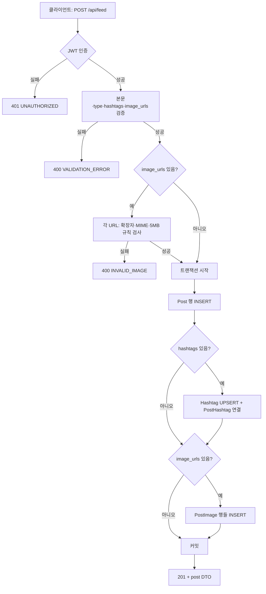
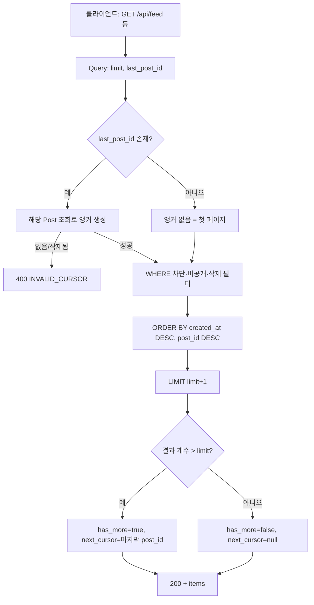
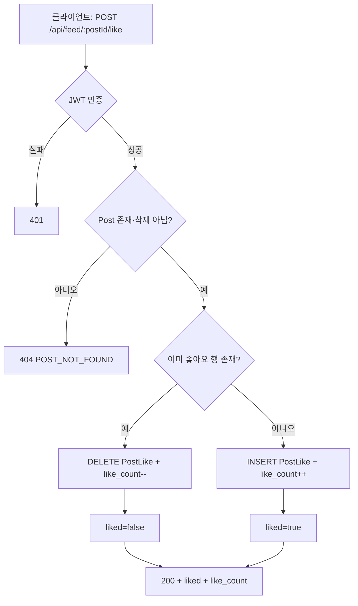

# F01 — 피드 플로우차트 (`F01Feed.md` 기반)

아래 다이어그램은 **Mermaid** 문법이다. GitHub·일부 에디터에서 미리보기 가능.

---

## 1. 게시글 작성 흐름

이미지 업로드(선택) → 해시태그 upsert → `posts` 저장 → 연관 테이블 반영.



---

## 2. 피드 조회 흐름 (커서 페이지네이션)

`last_post_id`로 앵커 → `(created_at, post_id)` 기준 이전 페이지.



---

## 3. 좋아요 토글 흐름



---

## 4. 검색 흐름 (자동완성 → 결과 탭 분기)

```mermaid
flowchart TD
  A[사용자 입력 q] --> B{엔터/검색 실행?}
  B -->|아니오| C[GET /api/search/autocomplete?q]
  C --> D[혼합 제안 목록 표시]
  D --> A
  B -->|예| E{type 선택: user | post}
  E --> F[GET /api/search?q&type&cursor&limit]
  F --> G{type == post}
  F --> H{type == user}
  G --> I[게시글 커서: last_post_id]
  H --> J[유저 커서: last_user_id]
  I --> K[탭: 게시글 결과]
  J --> L[탭: 유저 결과]
```

---

## 참고

- 실제 URL은 항상 **`/api` 접두사**를 붙인다 (`F01Feed.md` 1.1절).
