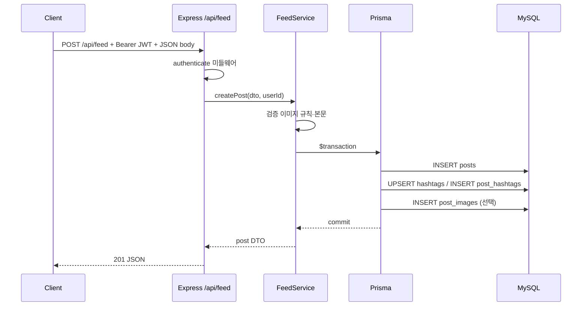
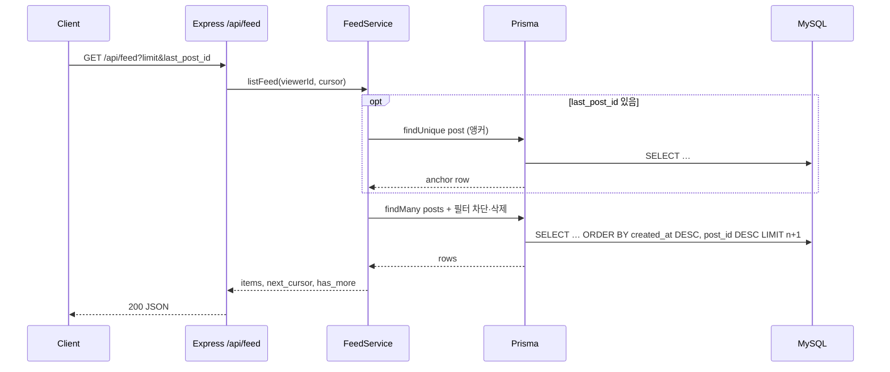
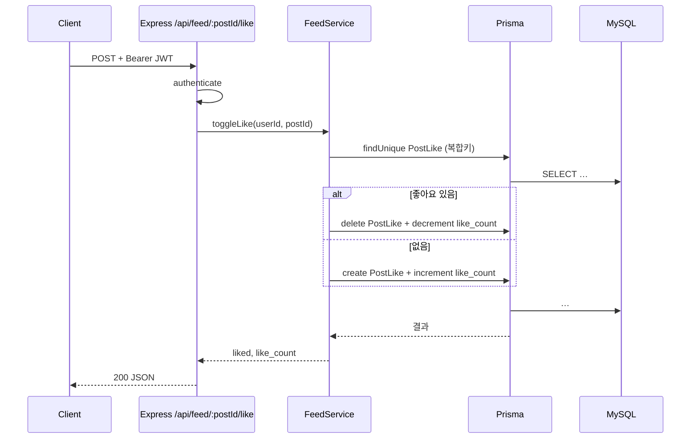
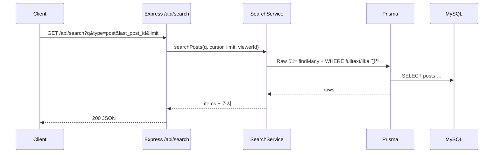
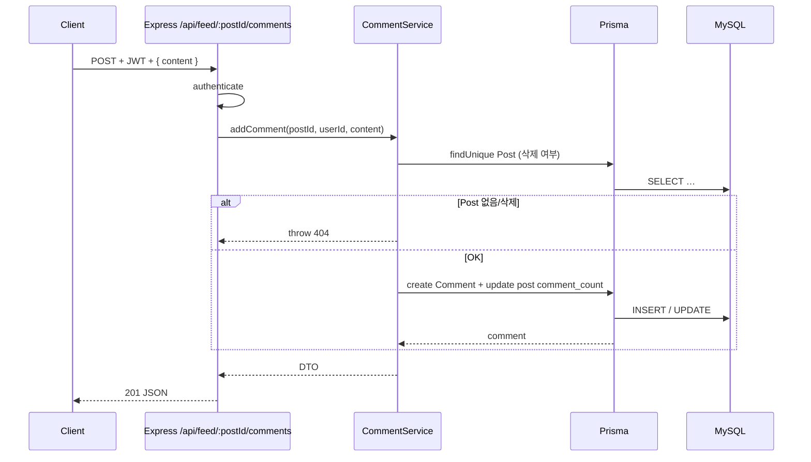

# F01 — 피드 시퀀스 다이어그램 (`F01Feed.md` 기반)

클라이언트 → **Express 라우터** → **(서비스 레이어)** → **Prisma** → **MySQL** 순서로 표현한다.  
서비스 레이어는 선택이나, 복잡한 트랜잭션·정책은 서비스에 두는 것을 권장한다.

---

## 1. 게시글 작성 (이미지 URL + 해시태그)

---

## 2. 전체 피드 조회 (커서)

---

## 3. 좋아요 토글

---

## 4. 통합 검색 (type=post)

---

## 5. 댓글 작성

---

## 참고

- 실패 시 응답 본문은 `F01Feed.md`의 **`{ error, code }`** 형식을 따른다.
